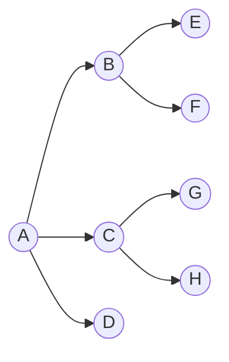

# DFS（深度优先搜索）与BFS（广度优先搜索）总结与思考
## Depth First Search(dfs)
不管有多少条路，先一条道走到底，不断往下往后遍历，直到无路可走，再返回到上一个状态继续。常用递归实现，非递归常用**栈**存储待访问结点。使用**栈**的原因是栈是**后进先出**的，而dfs前次遍历到终点，下次迭代需要回到上一个状态。

bfs步骤：
1. 不断递归，直到尽头。
2. 回溯到上一个可以继续的状态。

比如，现在有一个图，结点为 $A,B,C,D,E,F$。其中，$A$与$B,C,D$连接，$B$与$E,F$连接。$C$与$G,H$连接。

1. 访问结点$A$，把$A$压入栈（此时栈：$A$）。
2. 继续向下访问$B$，$B$入栈（此时栈：$B,A$）
3. 继续向下访问$E$，$E$入栈（此时栈：$E,B,A$）
4. $E$无法继续访问，$E$出栈（此时栈：$B,A$），返回到上一个可以继续向后访问的点$B$。
5. 继续向下访问$F$，$F$入栈（此时栈：$F,B,A$）。
6. $F$无法继续访问，$F$出栈（此时栈：$B,A$），返回到上一个可以继续向后访问的点$B$。
7. $B$的子结点已经全部被访问，无法继续向下访问，$B$出栈（此时栈：$A$），返回到上一个可以继续向后访问的点$A$。
8. 继续向下访问$C$，$C$入栈（此时栈：$C,A$）。
9. 不断重复。直到栈为空。
### 代码（递归）
```C++
int goal_x = 9, goal_y = 9;     //目标的坐标，暂时设置为右下角
int n = 10 , m = 10;               //地图的宽高，设置为10 * 10的表格
int graph[n][m];        //地图
int used[n][m];         //用来标记地图上那些点是走过的
int px[] = {-1, 0, 1, 0};   //通过px 和 py数组来实现左下右上的移动顺序
int py[] = {0, -1, 0, 1};
int flag = 0;           //是否能达到终点的标志
void DFS(int graph[][], int used[], int x, int y)
{
    // 如果与目标坐标相同，则成功
    if (graph[x][y] == graph[goal_x][goal_y]) {     
        printf("successful");
        flag = 1;
        return ;
    }
    // 遍历四个方向
    for (int i = 0; i != 4; ++i) {    
        //如果没有走过这个格子          
        int new_x = x + px[i], new_y = y + py[i];
        if (new_x >= 0 && new_x < n && new_y >= 0 
            && new_y < m && used[new_x][new_y] == 0 && !flag) {
            
            used[new_x][new_y] = 1;     //将该格子设为走过

            DFS(graph, used, new_x, new_y);      //递归下去

            used[new_x][new_y] = 0;//状态回溯，退回来，将格子设置为未走过
        }
    }
}
```
[代码出处](https://zhuanlan.zhihu.com/p/24986203)
### 代码（非递归）
```java
Class Node
{
   Char data;
   Public Node(char c)
   {
      this.data=c;
   }
}
public void dfs()
{
	//DFS uses Stack data structure
	Stack s=new Stack();
	s.push(this.rootNode);
	rootNode.visited=true;
	printNode(rootNode);
	while(!s.isEmpty())
	{
		Node n=(Node)s.peek();
		Node child=getUnvisitedChildNode(n);
		if(child!=null)
		{
			child.visited=true;
			printNode(child);
			s.push(child);
		}
		else
		{
			s.pop();
		}
	}
	//Clear visited property of nodes
	clearNodes();
}
```
[代码出处](https://www.codeproject.com/Articles/32212/Introduction-to-Graph-with-Breadth-First-Search-BF)
## Breadth First Search(bfs)
访问一个结点时，先把可能的选择记录下来，可以按照顺序选择访问其中一个，再把它可能的选择记录下来，再返回选择另外一个，不断重复。bfs通常用**队列**存储可能的选择，因为队列**先进先出**的属性。

比如，现在有一个图，结点为 $A,B,C,D,E,F$。其中，$A$与$B,C,D$连接，$B$与$E,F$连接。$C$与$G,H$连接。


1. 首先访问结点$A$，把可能的选择（$B,C,D$）记录下来，$B,C,D$入队，
2. 访问（$B$），$B$被访问后出队（此时队列：$C,D$），记录$B$可能的选择$E,F$，这里$E,F$入队（此时队列：$C,D,E,F$）。
3. 访问$C$（注：这里就相当于返回访问了，而不是继续沿着$B$的路径访问），$C$出队，记录$C$可能的选择，$G,H$入队（此时队列：$D,E,F,G,H$）。
4. 不断重复上面的步骤，也就是队列不断出队入队，直到队列为空。


### 代码
```java
Class Node
{
   Char data;
   Public Node(char c)
   {
      this.data=c;
   }
}
public void bfs()
{
	//BFS uses Queue data structure
	Queue q=new LinkedList();
	q.add(this.rootNode);
	printNode(this.rootNode);
	rootNode.visited=true;
	while(!q.isEmpty())
	{
		Node n=(Node)q.remove();
		Node child=null;
		while((child=getUnvisitedChildNode(n))!=null)
		{
			child.visited=true;
			printNode(child);
			q.add(child);
		}
	}
	//Clear visited property of nodes
	clearNodes();
}
```
[代码出处](https://www.codeproject.com/Articles/32212/Introduction-to-Graph-with-Breadth-First-Search-BF)
## 比较
### 数据结构
dfs：递归思想，栈结构。

bfs：队列结构
### 时间复杂度
大致相同。
### 使用
dfs适合目标明确，使用递归实现思路明确，但如果图深度过大，很可能会出现爆栈，需要改写成非递归形式。

bfs适合大范围寻找，使用队列存储待选择状态，不用递归实现，不会出现爆栈。

能用bfs尽量使用bfs，防止爆栈。
## 例题：岛的个数
[LeetCode 200. 岛屿数量](https://leetcode.com/problems/number-of-islands/)
### dfs实现（递归）
```C++
int find_island(int *arr, int m, int n) {
    int res = 0;
    for (int i = 0; i < m; i++) {
        for (int j = 0; j < n; j++) {
            if (arr[i * n + j] == 1) {
                res++;
                infect(arr, i, j, m, n);
            }
        }
    }
    return res;
}
void infect(int *arr, int i, int j, int m, int n) {
    if (i < 0 || i >= m || j < 0 || j >= n || arr[i * n + j] != 1)
        return;
    arr[i * n + j] = 2;
    infect(arr, i - 1, j, m, n);
    infect(arr, i + 1, j, m, n);
    infect(arr, i, j - 1, m, n);
    infect(arr, i, j + 1, m, n);
}
```
### bfs实现
```C++
int bfs(int *arr, int m, int n) {

    int direction_x[] = {-1, 1, 0, 0};
    int direction_y[] = {0, 0, -1, 1};
    int res = 0;

    bool visited[m*n];
    memset(visited, false, sizeof(visited));
    queue<int> q;
    int x, y;
    int xx, yy;

    for (int i = 0; i < m; i++) {
        for (int j = 0; j < n; j++) {
            if (arr[i * n + j] == 1 && !visited[i * n + j]) {
                q.push(i);
                q.push(j);
                visited[i * n + j] = true;
                res++;
                while (!q.empty())
                {
                    x = q.front();
                    q.pop();
                    y = q.front();
                    q.pop();
                    for (int k = 0; k < 4; k++){
                        xx = x + direction_x[k];
                        yy = y + direction_y[k];

                        if (xx < 0 || xx >= m || yy < 0 || yy >= n)
                            continue;
                        if (arr[xx * n + yy] == 1 && !visited[xx * n + yy]) {
                            visited[xx * n + yy] = true;
                            q.push(xx);
                            q.push(yy);
                        }
                    }
                }
            }
        }
    }
    return res;
}
```
## 参考
[搜索思想——DFS & BFS（基础基础篇）](https://zhuanlan.zhihu.com/p/24986203)

[Leetcode 200 Number of Islands 岛的个数](https://blog.csdn.net/smile_watermelon/article/details/47316935)

[Introduction to Graph with Breadth First Search(BFS) and Depth First Search(DFS) Traversal Implemented in JAVA](https://www.codeproject.com/Articles/32212/Introduction-to-Graph-with-Breadth-First-Search-BF)